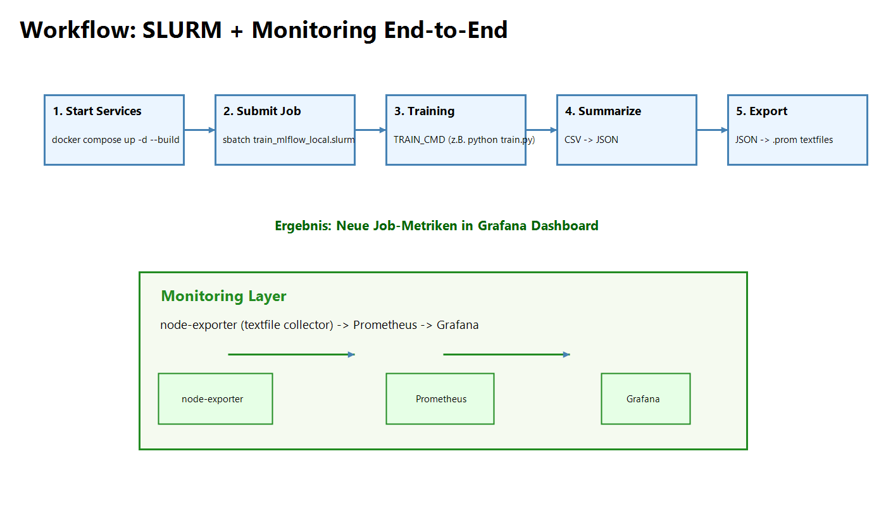
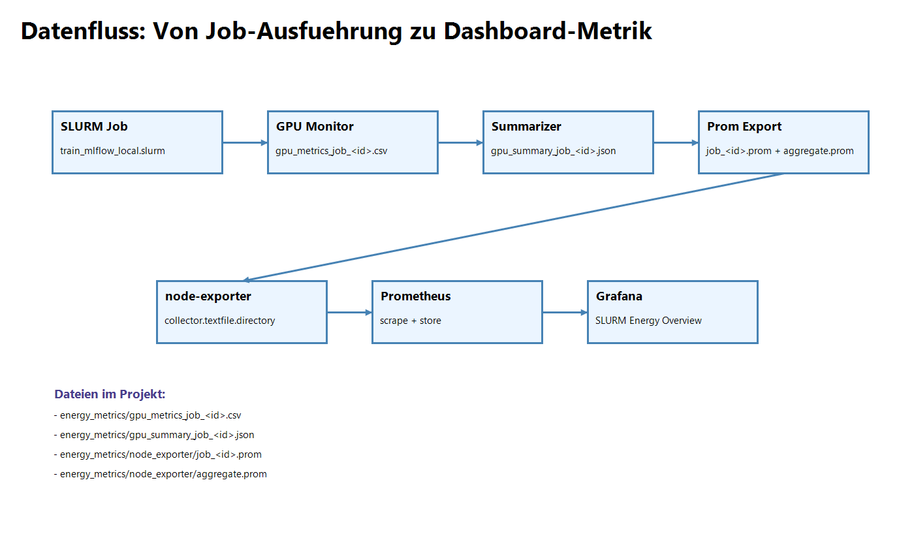

# SLURM + Prometheus + Grafana + node-exporter PoC

## Dokumentation

- Lokales Docker-Setup: diese README
- Word/PDF:
  - `SLURM_Prometheus_Grafana_Dokumentation.docx`
  - `SLURM_Prometheus_Grafana_Dokumentation.pdf`

Hinweis: Die Rancher/Kubernetes-Implementierung liegt im Branch `Rancher-sulrm`.

Dieses Projekt zeigt ein lokales **All-in-One Setup** fuer SLURM-basiertes Training mit:

- MLflow fuer Experiment-Tracking
- GPU-/Energie-Messung pro Job
- Export in Prometheus-Metriken
- Visualisierung in Grafana

Die Dokumentation entspricht inhaltlich der Word-Datei `SLURM_Prometheus_Grafana_Dokumentation.docx`.

## Ziel

Ziel ist ein reproduzierbarer Workflow, in dem SLURM-Jobs gestartet werden und deren Energie-, Kosten- und CO2-Kennzahlen automatisch in Grafana erscheinen.

## Architektur-Ueberblick

Der Stack laeuft ueber eine gemeinsame `docker-compose.yml`:

- `slurmctld` (SLURM Controller)
- `slurmd` (SLURM Worker mit GPU)
- `mlflow` (Tracking Server)
- `node-exporter` (Textfile Collector)
- `prometheus` (Scrape + Storage)
- `grafana` (Dashboard)
- `cadvisor` + `nvidia-dcgm-exporter` (System-/GPU-Metriken)

## Workflow (Visualisierung)



## Datenfluss (Visualisierung)



## End-to-End Datenfluss

1. Jobstart via SLURM (`sbatch`)
2. GPU-Monitoring schreibt CSV (`gpu_metrics_job_<id>.csv`)
3. Zusammenfassung schreibt JSON (`gpu_summary_job_<id>.json`)
4. Export erzeugt Prometheus-Textfiles (`job_<id>.prom`, `aggregate.prom`)
5. `node-exporter` liest Textfiles
6. Prometheus scraped die Metriken
7. Grafana visualisiert im Dashboard `SLURM Energy Overview`

## Relevante Dateien

- `docker-compose.yml`
- `prometheus/prometheus.yml`
- `slurm/train_mlflow_local.slurm`
- `slurm/train_mlflow_job.slurm`
- `slurm/export_job_metrics_prom.py`
- `grafana/dashboards/slurm-energy-overview.json`
- `grafana/provisioning/datasources/datasource.yml`
- `grafana/provisioning/dashboards/dashboards.yml`
- `setup_poc.ps1`

## Start & Betrieb

### 0) Umgebungsparameter

```powershell
copy .env.example .env
```

Alle uebergebbaren Job-Parameter fuer `setup_poc.ps1` sind in `.env(.example)` gepflegt.

### 1) Stack starten

```powershell
docker compose up -d --build
```

### 2) Job submitten

```powershell
docker exec -it slurmctld bash -lc "TRAIN_CMD='python train.py' sbatch /workspace/slurm/train_mlflow_local.slurm"
```

### 3) Wichtige UIs

- Grafana: <http://localhost:3000>
- Prometheus: <http://localhost:9090>
- MLflow: <http://localhost:5000>

Direktlink Dashboard:

- <http://localhost:3000/d/slurm-energy-overview/slurm-energy-overview?orgId=1&from=now-30d&to=now>

## Test-Checkliste

### A) Container laufen

```powershell
docker ps
```

Erwartet: `slurmctld`, `slurmd`, `prometheus`, `grafana`, `node-exporter`, `mlflow`.

### B) SLURM Jobstatus

```powershell
docker exec -it slurmctld squeue
docker exec -it slurmctld scontrol show job <JOBID>
```

Erwartet: Jobstate `COMPLETED`.

### C) Dateien je Job

- `energy_metrics/gpu_metrics_job_<JOBID>.csv`
- `energy_metrics/gpu_summary_job_<JOBID>.json`
- `energy_metrics/node_exporter/job_<JOBID>.prom`
- `energy_metrics/node_exporter/aggregate.prom`

### D) node-exporter

```powershell
curl http://localhost:9100/metrics
```

Erwartet:

- `node_textfile_scrape_error 0`
- `slurm_job_*` und `slurm_jobs_*` vorhanden

### E) Prometheus Queries

Beispiele:

- `slurm_jobs_total`
- `slurm_job_training_energy_kwh`
- `slurm_job_estimated_electricity_cost_eur`

### F) Grafana

Dashboard `SLURM Energy Overview` zeigt:

- KPI-Karten (Jobs total, Energy, Cost, CO2)
- Zeitreihen pro Job

## Typische Fehler & Loesungen

### 1) Grafana zeigt "No data"

- Prometheus-Query direkt pruefen (`slurm_jobs_total`).
- Zeitbereich im Dashboard passend setzen (`Last 30 days`).
- Richtige Org/Dashboard-URL verwenden (`orgId=1`).

### 2) `node_textfile_scrape_error = 1`

- `.prom` mit Linux-Zeilenende (`LF`) schreiben.
- Dateirechte lesbar setzen (`0644`).

### 3) SLURM Container starten nicht mit

- Nur die zentrale `docker-compose.yml` verwenden.

## Schneller Demo-Ablauf

1. `docker compose up -d --build`
2. Dashboard in Grafana oeffnen
3. Job via `sbatch` starten
4. Job-Completion zeigen
5. Neue Job-ID in Grafana-Metriken zeigen

## Dokumente

- Word: `SLURM_Prometheus_Grafana_Dokumentation.docx`
- PDF: `SLURM_Prometheus_Grafana_Dokumentation.pdf`
